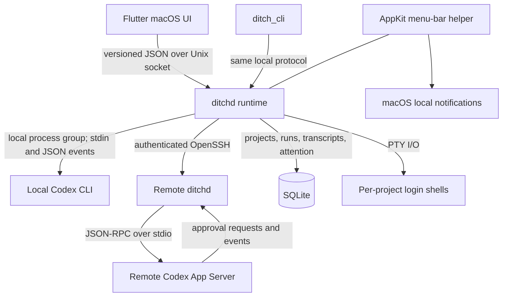

<!-- sparkle-sign-warning:
IMPORTANT: This file was signed by Sparkle. Any modifications to this file requires updating signatures in appcasts that reference this file! This will involve re-running generate_appcast or sign_update.
-->
# Ditch

**Ditch Community Edition** is a macOS workspace for running, following, and returning to local or SSH-hosted Codex sessions across multiple projects.

[Download](https://theditch.dev/#beta) · [Website](https://theditch.dev)

## Status

Ditch Community Edition is pre-release software under active development. It currently supports macOS 11 or later and Codex CLI. The macOS beta is distributed as a `.dmg` through [theditch.dev](https://theditch.dev/#beta), and the app can also be built from source.

Today it can register multiple local or SSH-hosted projects, run concurrent Codex sessions locally or on remote Linux/macOS hosts, preserve their transcripts and Codex thread IDs, resume completed threads, post local completion and failure notifications, and provide a project shell and small text-file editor. The background runtime remains alive when the main window closes.

Current limitations are:

- macOS and Codex are the only working platform/provider combination.
- Local projects run through a separate `codex exec` process for each turn and do not yet support interactive approvals. SSH projects use Codex App Server and route its command, file, and network approval requests to the Mac.
- Closing the foreground window preserves work, but explicitly quitting the menu-bar runtime stops active agents. After an unexpected runtime restart, previously active runs are marked stale and can only be continued when Codex supplied a resumable thread ID.
- The repository contains types and placeholder directories for other providers, hooks, MCP, tasks, and worktrees, but those are not complete user-facing features.
- There is no GitHub release workflow or CI workflow in the repository yet.

## Why Ditch

Once several coding sessions are active, starting Codex is no longer the difficult part. The operational work is remembering which project each session belongs to, finding the right transcript, noticing that a run finished or failed, and returning to it without reconstructing context from terminal windows.

Ditch gives that work a project-oriented home. It keeps session history and status together, routes prompts back to the correct Codex thread, and raises local attention when a run reaches a result or encounters a problem.

A terminal remains the most direct way to run one Codex session. Ditch is useful when the surrounding workflow matters: several projects, concurrent runs, a durable conversation list, notifications, and quick access to each repository's shell and files. It operates around the installed Codex CLI rather than replacing it.

## Quick Start

### Requirements

- macOS 11 or later
- A compatible [Codex CLI](https://learn.chatgpt.com/docs/codex/cli) installation, signed in with `codex login`
- For SSH projects, a reachable OpenSSH host running Linux or macOS

Ditch does not pin a minimum Codex version. On first run it checks the selected executable for the `codex exec` JSON/resume behavior and command-line options it needs. Remote setup installs a matching Ditch runtime under the SSH user's `~/.ditch` and can install or authenticate Codex for that user. Bubblewrap and elevated privileges are not required for the SSH App Server path.

### Install

Download the macOS beta from [theditch.dev](https://theditch.dev/#beta). The website sends the `.dmg` download link by email. Open the downloaded disk image and install Ditch, then launch the app.

To compile the application yourself, follow [Build From Source](#build-from-source).

### First run

1. Open Ditch and let the setup screen check the available Codex installations, authentication, and notification permission.
2. Add a local repository, or choose an OpenSSH host and remote directory. The default policy requires an existing Git repository; the add-project dialog can instead initialize Git or explicitly allow Codex outside Git.
3. Select the project, choose **New Agent**, enter a prompt, and start the session. For SSH projects, respond to App Server requests with **Deny**, **Allow Once**, or **Allow for Session** when approval is needed.
4. Open another project or start another agent while the first one runs.
5. Return from the project list, notification panel, or macOS notification when a run completes or fails. Send a follow-up to continue the saved Codex thread.

Adding a project creates `.ditch/project.json` plus `.ditch/agents`, `.ditch/hooks`, and `.ditch/mcp` directories in that project. At present, only the project metadata is operational; the three subdirectories reserve project-local integration space.

## What You Can Do

### Run Codex across projects

Register local or SSH-hosted repositories and run more than one Codex agent at a time. Each session is tied to its project root, has its own lifecycle state, and can be stopped without targeting unrelated Codex processes.

For SSH projects, Ditch discovers OpenSSH hosts, installs a matching runtime under the SSH user's `~/.ditch` on Linux or macOS, and runs Codex App Server on that host while the Mac remains the control surface. The remote runtime verifies the project identity, resumes saved Codex threads, and sends approval requests and results over the authenticated SSH connection. Pending approvals are restored after a connection interruption. Bubblewrap is optional, and approved actions run with the existing SSH user's permissions.

### Return to prior work

Ditch stores prompts, assistant output, tool activity, run state, and Codex thread IDs. Conversations survive foreground-app restarts, earlier messages can be paged into the chat, and a follow-up resumes the original Codex thread when its identity and `CODEX_HOME` still match.

### Notice results without watching every window

The menu-bar helper shows the runtime's active-session and unread-attention counts. macOS notifications and the in-app notification panel surface completed runs, failures, and detected workspace-write problems, with navigation back to the relevant project and agent.

### Use a shell in the selected project

Each project can open one daemon-owned login-shell PTY in its repository root. The embedded terminal supports input, output, and resize events and can be docked, split alongside the workspace, or maximized.

### Inspect and edit project files

The project browser lists files while excluding common generated and internal directories. Its editor handles existing UTF-8 text files up to 1 MB, checks revisions before saving, preserves file permissions, and prevents paths from escaping the selected project root.

### Set the next Codex turn's execution profile

The composer discovers available models from the selected Codex installation and can apply model, network-access, and approval presets to the next turn. For local projects, **Approve for me** uses Codex's workspace-write sandbox without interactive approval, **Full Access** disables the sandbox after explicit confirmation, and interactive **Ask for approval** remains unavailable in the local transport. SSH projects do not inherit the desktop **Full Access** setting: they always use Codex App Server's interactive approval policy.

## How It Works

Ditch does not replace Codex and does not send prompts to a separate Ditch agent service. The foreground Flutter application is a client of a local Rust runtime. That runtime owns session state and local child processes, invokes the selected Codex CLI for local projects, and manages the authenticated SSH connection to remote runtimes. Both paths publish typed events back to the UI.



The runtime is compiled as a Rust static library into the menu-bar login-item helper. AppKit stays on the helper's main thread while `ditchd` serves a Unix-domain socket on a worker thread. The foreground application can quit or crash without sending a runtime shutdown; reopening it requests an authoritative snapshot and reconnects to the event stream. An explicit quit from the menu-bar helper asks before terminating active sessions.

For local Codex work, `ditchd` starts `codex exec --json` in a dedicated process group for each turn and sends the prompt over stdin. Follow-ups use `codex exec resume` with the persisted native thread ID. Dedicated process groups allow Stop to interrupt and, if necessary, terminate the full child tree instead of leaving helper processes behind.

For SSH projects, the local runtime forwards an SSH-only request to the matching remote `ditchd`. The remote runtime starts one `codex app-server` process for the active turn, initializes a thread or resumes its persisted thread ID, and translates App Server JSON-RPC events into Ditch events. Approval responses travel back over the same SSH connection before App Server continues the action. A non-SSH runtime rejects these internal launch requests.

Projects, session metadata, transcripts, attention state, and selected runtime settings are durable. Project terminals are PTYs owned by the running daemon, not by Flutter. File reads and writes also pass through the daemon, which enforces project-root and revision checks.

## Local-First & Privacy

The application, runtime, socket, primary database, project access, and agent execution run on the Mac. Optional Remote Control is an explicit opt-in connectivity feature: it sends anonymous machine/device identity, sanitized project/session/attention status, push tokens, and privacy-safe audit metadata to a Ditch-managed relay. Sensitive prompts and transcript pages are relayed end-to-end encrypted and full transcript bodies are not stored by that service. The relay is built and deployed independently from the `TheDitchRelay` repository; this Mac repository contains only the daemon client, desktop UI, and shared Remote Protocol contract. The repository contains no analytics SDK or crash-reporting integration.

Release builds use `https://relay.ditchnow.nl` as the built-in Remote Control origin; users do not configure Cloudflare or a relay address. Developers may override it at process startup with `DITCH_REMOTE_RELAY_ORIGIN`. Overrides must be an HTTPS origin without credentials, path, query, or fragment. Plain HTTP is accepted only for loopback development (`localhost`, `127.0.0.1`, or `::1`).

The download website is a separate boundary: its beta form collects an email address to send access and states that it records whether the download link is opened.

Ditch stores its application data under the compatibility path `~/Library/Application Support/The Ditch/`, including `ditch.sqlite3`, the local sockets, runtime logs, the runtime PID, and an optional persisted `CODEX_HOME` path. UI preferences use the normal macOS preferences store. Each registered project receives the `.ditch` metadata described above. For SSH projects, the matching runtime, state, and logs are stored under the SSH user's `~/.ditch` on the selected host; prompts, events, and approval responses cross the authenticated SSH connection.

Prompts and parsed Codex output are stored in the local SQLite database. Ditch passes prompts to the Codex CLI on the selected local or SSH host and launches it in the selected project directory. Remote actions execute with the authenticated SSH account's existing permissions; Ditch adds no privileges to that account. Codex itself communicates with OpenAI and is subject to the user's Codex configuration, account, and OpenAI data handling; “local-first” does not mean that model execution is offline.

Authentication remains with Codex on each execution host. Ditch locates compatible executables, runs `codex login status` to check readiness, and can open `codex login` locally or in a remote setup terminal. It does not implement an OpenAI sign-in flow or store Codex or SSH credentials in project metadata. Codex's own thread data remains in the active `CODEX_HOME` (normally `~/.codex`), outside Ditch's database.

The in-app **Uninstall Ditch…** command stops active agents, unregisters the helper, removes Ditch-owned application data and preferences, and moves the app to Trash. It does not delete registered project directories or their `.ditch` metadata.

## Open Source

This repository contains Ditch Community Edition: the complete current local and SSH product described above, including the macOS application, runtimes, Codex integration, persistence, terminal, file tools, and notifications. It is open-source software licensed under the GNU Affero General Public License v3.0.

## Build From Source

Building Ditch Community Edition requires Flutter with macOS desktop support and a Dart SDK compatible with `^3.10.4`, Rust 1.85 or later, Xcode and its macOS command-line build tools, and Git.

Fetch the dependencies and run the app from the Flutter project:

```sh
git clone https://github.com/DitchNow/TheDitch.git
cd TheDitch/apps/macos
flutter pub get
flutter run -d macos
```

The macOS Xcode build phase runs the equivalent of the following for its bundled native components:

```sh
cd ../..
cargo build --locked -p ditchd -p ditch_cli
```

To build remote runtimes for x86-64 Linux and Intel macOS without changing the host app architecture:

```sh
export DITCH_REMOTE_TARGETS="x86_64-unknown-linux-gnu x86_64-apple-darwin"
scripts/build-remote-artifacts
```

The artifact builder uses Docker for Linux when the target standard library is unavailable locally and falls back to a rustup-managed compiler for installed macOS cross-targets. Its checksum manifest records the exact build identifier and remote runtime protocol version.

Useful checks from the repository root are:

```sh
cargo fmt --all -- --check
cargo test --workspace

cd apps/macos
flutter analyze
flutter test
```

For a release-mode app bundle, run `flutter build macos` from `apps/macos`. Source builds use ad hoc signing and do not require access to the maintainer's Apple Developer account. The build script selects the host architecture, uses the app's macOS 11 deployment target, compiles release Rust artifacts, links the runtime helper, and signs the nested executables with the Xcode-selected identity. Official distribution builds must supply their signing identity and team outside the committed project configuration.

## Repository Structure

```text
apps/macos/                 Flutter desktop UI and native AppKit integration
crates/ditchd/              Runtime server, Codex execution, PTYs, files, and lifecycle
crates/ditch_protocol/      Versioned local requests, responses, and events
crates/ditch_store/         SQLite persistence and per-project .ditch metadata
crates/ditch_core/          Shared domain types and application paths
crates/ditch_cli/           Local command-line client used by the helper and diagnostics
crates/ditch_agents/        Early provider adapter abstractions
crates/ditch_runtime/       Early generic runtime/PTY abstractions
crates/ditch_orchestrator/  Early orchestration abstractions
```

The production path currently concentrates in `apps/macos`, `ditchd`, `ditch_protocol`, and `ditch_store`. Some generic crates describe a broader architecture but are not yet the path used by the shipped UI.

## Roadmap

The repository does not maintain a committed public roadmap. SSH projects now use Codex App Server with interactive approvals, while local projects retain the process-per-turn transport. Current implementation notes focus on bringing equivalent approval handling to local sessions and making per-turn prompt/model controls more complete. These are active design directions, not release commitments.

Use [GitHub Issues](https://github.com/DitchNow/TheDitch/issues) for reproducible bugs, regressions, and concrete actionable improvements. Use [GitHub Discussions](https://github.com/DitchNow/TheDitch/discussions) for broader ideas, workflow feedback, architecture discussion, and exploratory proposals.

## Contributing

Bug reports, focused fixes, and well-scoped improvements are welcome. Before proposing a large feature or architectural change, open an issue so the direction can be discussed first.

See [CONTRIBUTING.md](CONTRIBUTING.md) for development setup, issue guidelines, architectural constraints, and pull-request expectations.

## Security

Ditch can execute processes and read or write files inside registered projects, and local **Full Access** deliberately removes Codex's sandbox restrictions. SSH sessions always use App Server's interactive approval policy; when App Server requests approval, Ditch shows the action, command, and target before returning the user's decision. Approved remote actions have the SSH account's existing permissions and receive no additional privileges from Ditch. Review the selected project, execution profile, host, and prompt before starting a turn. See [SECURITY.md](SECURITY.md) for vulnerability-reporting guidance.

## Community / Support

- Product website and beta download: [theditch.dev](https://theditch.dev)
- Reproducible bugs, regressions, and actionable improvements: [GitHub Issues](https://github.com/DitchNow/TheDitch/issues)
- Questions, broader ideas, workflow feedback, and architecture discussion: [GitHub Discussions](https://github.com/DitchNow/TheDitch/discussions)
- Codex installation and authentication: [Codex CLI documentation](https://learn.chatgpt.com/docs/codex/cli)
- SSH approval protocol: [Codex App Server documentation](https://learn.chatgpt.com/docs/app-server)

## License

Ditch Community Edition is open-source software licensed under the [GNU Affero General Public License v3.0](LICENSE) (`AGPL-3.0-only`).

See [LICENSE](LICENSE) for the full license text.
