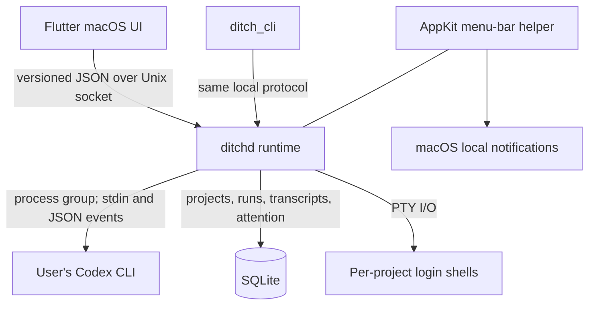

# The Ditch

The Ditch is a local macOS workspace for running, following, and returning to coding agent sessions across multiple projects.

[Download](https://theditch.dev/#beta) · [Website](https://theditch.dev) · [Architecture](docs/adr/0001-runtime-supervision.md)

## Status

The Ditch is pre-release software under active development. It currently supports macOS 11 or later and Codex CLI. The macOS beta is distributed as a `.dmg` through [theditch.dev](https://theditch.dev/#beta), and the app can also be built from source.

Today it can register multiple local projects, run concurrent Codex sessions, preserve their transcripts and Codex thread IDs, resume completed threads, post local completion and failure notifications, and provide a project shell and small text-file editor. The background runtime remains alive when the main window closes.

Current limitations are:

- macOS and Codex are the only working platform/provider combination.
- Codex runs through a separate `codex exec` process for each turn. Interactive approval requests are not supported; the UI disables **Ask for approval**.
- Closing the foreground window preserves work, but explicitly quitting the menu-bar runtime stops active agents. After an unexpected runtime restart, previously active runs are marked stale and can only be continued when Codex supplied a resumable thread ID.
- The repository contains types and placeholder directories for other providers, hooks, MCP, tasks, and worktrees, but those are not complete user-facing features.
- There is no GitHub release workflow, CI workflow, contribution policy, security policy, or open-source license in the repository yet.

## Why The Ditch

Once several coding sessions are active, starting Codex is no longer the difficult part. The operational work is remembering which project each session belongs to, finding the right transcript, noticing that a run finished or failed, and returning to it without reconstructing context from terminal windows.

The Ditch gives that work a project-oriented home. It keeps session history and status together, routes prompts back to the correct Codex thread, and raises local attention when a run reaches a result or encounters a problem.

A terminal remains the most direct way to run one Codex session. The Ditch is useful when the surrounding workflow matters: several projects, concurrent runs, a durable conversation list, notifications, and quick access to each repository's shell and files. It operates around the installed Codex CLI rather than replacing it.

## Quick Start

### Requirements

- macOS 11 or later
- A compatible [Codex CLI](https://learn.chatgpt.com/docs/codex/cli) installation, signed in with `codex login`

The Ditch does not pin a minimum Codex version. On first run it checks the selected executable for the `codex exec` JSON/resume behavior and command-line options it needs.

### Install

Download the macOS beta from [theditch.dev](https://theditch.dev/#beta). The website sends the `.dmg` download link by email. Open the downloaded disk image and install The Ditch, then launch the app.

To compile the application yourself, follow [Build From Source](#build-from-source).

### First run

1. Open The Ditch and let the setup screen check the available Codex installations, authentication, and notification permission.
2. Add a repository. The default policy requires an existing Git repository; the add-project dialog can instead initialize Git or explicitly allow Codex outside Git.
3. Select the project, choose **New Agent**, enter a prompt, and start the session.
4. Open another project or start another agent while the first one runs.
5. Return from the project list, notification panel, or macOS notification when a run completes or fails. Send a follow-up to continue the saved Codex thread.

Adding a project creates `.ditch/project.json` plus `.ditch/agents`, `.ditch/hooks`, and `.ditch/mcp` directories in that project. At present, only the project metadata is operational; the three subdirectories reserve project-local integration space.

## What You Can Do

### Run Codex across projects

Register local repositories and run more than one Codex agent at a time. Each session is tied to its project root, has its own lifecycle state, and can be stopped without targeting unrelated Codex processes.

### Return to prior work

The Ditch stores prompts, assistant output, tool activity, run state, and Codex thread IDs. Conversations survive foreground-app restarts, earlier messages can be paged into the chat, and a follow-up resumes the original Codex thread when its identity and `CODEX_HOME` still match.

### Notice results without watching every window

The menu-bar helper shows the runtime's active-session and unread-attention counts. macOS notifications and the in-app notification panel surface completed runs, failures, and detected workspace-write problems, with navigation back to the relevant project and agent.

### Use a shell in the selected project

Each project can open one daemon-owned login-shell PTY in its repository root. The embedded terminal supports input, output, and resize events and can be docked, split alongside the workspace, or maximized.

### Inspect and edit project files

The project browser lists files while excluding common generated and internal directories. Its editor handles existing UTF-8 text files up to 1 MB, checks revisions before saving, preserves file permissions, and prevents paths from escaping the selected project root.

### Set the next Codex turn's execution profile

The composer discovers available models from the selected Codex installation and can apply model, network-access, and approval presets to the next turn. **Approve for me** uses Codex's workspace-write sandbox without interactive approval; **Full Access** disables the sandbox and requires explicit confirmation. Interactive **Ask for approval** is visible but unavailable in the current transport.

## How It Works

The Ditch does not replace Codex and does not send prompts to a separate Ditch agent service. The foreground Flutter application is a client of a local Rust runtime. That runtime owns session state and child processes, invokes the user's selected Codex CLI, parses its JSON event stream, and publishes typed events back to the UI.



The runtime is compiled as a Rust static library into the menu-bar login-item helper. AppKit stays on the helper's main thread while `ditchd` serves a Unix-domain socket on a worker thread. The foreground application can quit or crash without sending a runtime shutdown; reopening it requests an authoritative snapshot and reconnects to the event stream. An explicit quit from the menu-bar helper asks before terminating active sessions.

For Codex work, `ditchd` starts `codex exec --json` in a dedicated process group for each turn and sends the prompt over stdin. Follow-ups use `codex exec resume` with the persisted native thread ID. Dedicated process groups allow Stop to interrupt and, if necessary, terminate the full child tree instead of leaving helper processes behind.

Projects, session metadata, transcripts, attention state, and selected runtime settings are durable. Project terminals are PTYs owned by the running daemon, not by Flutter. File reads and writes also pass through the daemon, which enforces project-root and revision checks. See [ADR 0001](docs/adr/0001-runtime-supervision.md) for the foreground/helper/runtime lifecycle decision.

## Local-First & Privacy

The application, runtime, socket, database, project access, and notification processing run on the Mac. The repository contains no Ditch-hosted prompt proxy, analytics SDK, or crash-reporting integration.

The download website is a separate boundary: its beta form collects an email address to send access and states that it records whether the download link is opened.

The Ditch stores its application data under `~/Library/Application Support/The Ditch/`, including `ditch.sqlite3`, the local sockets, runtime logs, the runtime PID, and an optional persisted `CODEX_HOME` path. UI preferences use the normal macOS preferences store. Each registered project receives the `.ditch` metadata described above.

Prompts and parsed Codex output are stored in the local SQLite database. The Ditch passes prompts to the locally installed Codex CLI and launches it in the selected project directory, so Codex can read or modify files according to the chosen sandbox and network settings. Codex itself communicates with OpenAI and is subject to the user's Codex configuration, account, and OpenAI data handling; “local-first” does not mean that model execution is offline.

Authentication remains with Codex. The Ditch locates compatible executables, runs `codex login status` to check readiness, and can open `codex login` in Terminal. It does not implement an OpenAI sign-in flow or store Codex credentials. Codex's own thread data remains in the active `CODEX_HOME` (normally `~/.codex`), outside The Ditch's database.

The in-app **Uninstall The Ditch…** command stops active agents, unregisters the helper, removes The Ditch-owned application data and preferences, and moves the app to Trash. It does not delete registered project directories or their `.ditch` metadata.

## Open Source & Commercial Development

The source is currently visible in this repository, and the product is being developed commercially. The repository does not define separate community and commercial editions or an implemented free/paid feature boundary.

This repository is **not currently licensed as open source**: the Rust workspace is marked `UNLICENSED`, the app metadata states “All rights reserved,” and there is no `LICENSE` file. Source availability alone does not grant rights to use, modify, or redistribute the code. No future licensing commitment should be inferred from the repository's current state.

## Build From Source

Building The Ditch requires Flutter with macOS desktop support and a Dart SDK compatible with `^3.10.4`, Rust 1.85 or later, Xcode and its macOS command-line build tools, and Git.

Fetch the dependencies and run the app from the Flutter project:

```sh
git clone https://github.com/DitchNow/TheDitch.git
cd TheDitch/apps/macos
flutter pub get
flutter run -d macos
```

The macOS Xcode build phase runs the equivalent of the following for its bundled native components:

```sh
cd ../..
cargo build --locked -p ditchd -p ditch_cli
```

Useful checks from the repository root are:

```sh
cargo fmt --all -- --check
cargo test --workspace

cd apps/macos
flutter analyze
flutter test
```

For a release-mode app bundle, run `flutter build macos` from `apps/macos`. The build script selects the host architecture, uses the app's macOS 11 deployment target, compiles release Rust artifacts, links the runtime helper, and signs the nested executables with the Xcode-selected identity (or ad hoc identity where applicable).

## Repository Structure

```text
apps/macos/                 Flutter desktop UI and native AppKit integration
crates/ditchd/              Runtime server, Codex execution, PTYs, files, and lifecycle
crates/ditch_protocol/      Versioned local requests, responses, and events
crates/ditch_store/         SQLite persistence and per-project .ditch metadata
crates/ditch_core/          Shared domain types and application paths
crates/ditch_cli/           Local command-line client used by the helper and diagnostics
crates/ditch_agents/        Early provider adapter abstractions
crates/ditch_runtime/       Early generic runtime/PTY abstractions
crates/ditch_orchestrator/  Early orchestration abstractions
docs/adr/                   Accepted architectural decisions
```

The production path currently concentrates in `apps/macos`, `ditchd`, `ditch_protocol`, and `ditch_store`. Some generic crates describe a broader architecture but are not yet the path used by the shipped UI.

## Roadmap

The repository does not maintain a committed public roadmap. Current implementation notes focus on replacing the process-per-turn Codex transport with a long-lived integration capable of interactive approvals, and on making per-turn prompt/model controls more complete. These are active design directions, not shipped features or release commitments.

There is not yet a public issue tracker or other published roadmap channel to link here.

## Contributing

There is no `CONTRIBUTING.md`, public issue tracker, or documented pull-request policy yet. Before changing runtime ownership or process lifecycle, read [ADR 0001](docs/adr/0001-runtime-supervision.md).

Because the repository is currently unlicensed and has no documented contribution terms, clarify those terms with the maintainers before submitting a substantive code contribution.

## Security

The Ditch can execute processes and read or write files inside registered projects, and **Full Access** deliberately removes Codex's sandbox restrictions. Review the selected project, execution profile, and prompt before starting a turn.

There is no `SECURITY.md` and no documented private vulnerability-reporting channel. Do not put exploit details or local secrets in a public discussion; the repository needs to publish a private reporting path before it can give complete reporting instructions here.

## Community / Support

- Product website and beta download: [theditch.dev](https://theditch.dev)
- Runtime architecture: [ADR 0001](docs/adr/0001-runtime-supervision.md)
- Codex installation and authentication: [Codex CLI documentation](https://learn.chatgpt.com/docs/codex/cli)

No public bug tracker, Discord, Slack, Discussions forum, or other maintained support channel is documented in the repository.

## License

No `LICENSE` file is present. The Rust workspace declares `license = "UNLICENSED"`, and the macOS app metadata states “All rights reserved.” This repository should not be described or treated as open source unless and until its maintainers add an applicable license.
